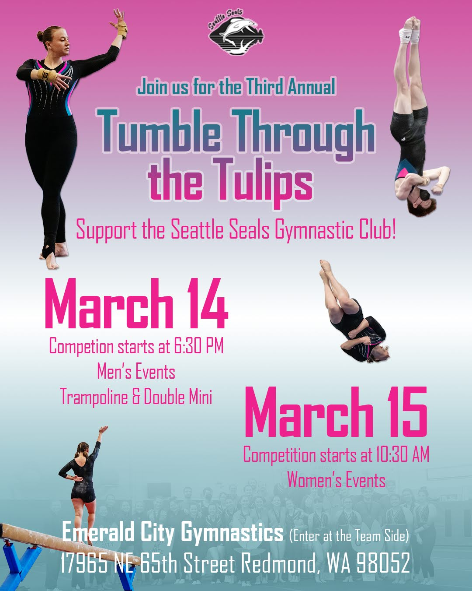

```{r setup, echo=FALSE, message=FALSE, results='markup'}
knitr::opts_chunk$set(echo = TRUE)
library(dplyr)
library(here)
library(ggplot2)
library(DT)

# functions
team.score <- function(df, event){
  top3.df <- df %>% 
    group_by(Team) %>% select(Team, event) %>%
    slice_max(order_by = !!as.name(event), n = 3, with_ties = FALSE) %>%
    summarise(event = sum(!!as.name(event)))
  return(top3.df)
}
```



Hosted by the [Seattle Seals](https://www.seattlesealsgymnasticsclub.com/home) who are a [NAIGC](https://naigc.org/) Gymnastics Club. 

# Results

Results: [https://danagibbon.github.io/Tulips-Meet_2026/2026-Tulips-Meet-results.html](https://danagibbon.github.io/Tulips-Meet_2026/2026-Tulips-Meet-results.html)

## WAG Xcel Silver {.tabset .tabset-fade}

```{r}
# read in data
xs.results <- read.csv(here::here("data","WAG-Silver-Results-Tulips.csv")) %>%
    mutate(across(c(Team),factor))

```


### Vault

```{r xs.vault}
xs.vault <- xs.results %>%
  select(Athlete, Team, Vault) %>%
  arrange(desc(Vault)) %>% 
  mutate(Rank = dense_rank(desc(Vault))) %>%
  relocate(Rank, Team)

datatable(xs.vault, extensions = 'Buttons',
          options = list(dom = 'Bfrtip', buttons = c('copy', 'csv', 'excel', 'pdf', 'print')),
          rownames = FALSE)
```

### Uneven Bars

```{r xs.bars}
xs.bars <- xs.results %>%
  select(Athlete, Team, Bars) %>%
  arrange(desc(Bars)) %>% 
  mutate(Rank = dense_rank(desc(Bars))) %>%
  relocate(Rank, Team)

datatable(xs.bars, extensions = 'Buttons',
          options = list(dom = 'Bfrtip', buttons = c('copy', 'csv', 'excel', 'pdf', 'print')),
          rownames = FALSE)
```

### Balance Beam

```{r xs.beam}
xs.Beam <- xs.results %>%
  select(Athlete, Team, Beam) %>%
  arrange(desc(Beam)) %>% 
  mutate(Rank = dense_rank(desc(Beam))) %>%
  relocate(Rank, Team)

datatable(xs.Beam, extensions = 'Buttons',
          options = list(dom = 'Bfrtip', buttons = c('copy', 'csv', 'excel', 'pdf', 'print')),
          rownames = FALSE)
```

### Floor Exercise

```{r xs.floor}
xs.Floor <- xs.results %>%
  select(Athlete, Team, Floor) %>%
  arrange(desc(Floor)) %>% 
  mutate(Rank = dense_rank(desc(Floor))) %>%
  relocate(Rank, Team)

datatable(xs.Floor, extensions = 'Buttons',
          options = list(dom = 'Bfrtip', buttons = c('copy', 'csv', 'excel', 'pdf', 'print')),
          rownames = FALSE)
```

### All-Around

```{r xs.AA}
xs.AA <- xs.results %>%
  select(Athlete, Team, All.Around) %>%
  arrange(desc(All.Around)) %>% 
  mutate(Rank = dense_rank(desc(All.Around))) %>%
  relocate(Rank, Team)

datatable(xs.AA, extensions = 'Buttons',
          options = list(dom = 'Bfrtip', buttons = c('copy', 'csv', 'excel', 'pdf', 'print')),
          rownames = FALSE)
```

### Team Score

```{r, warning=FALSE}
# calculate 
xs.team.vt <- team.score(df = xs.results, event = "Vault")
colnames(xs.team.vt)[2] <- "Vault"
xs.team.bars <- team.score(df = xs.results, event = "Bars")
colnames(xs.team.bars)[2] <- "Bars"
xs.team.beam <- team.score(df = xs.results, event = "Beam")
colnames(xs.team.beam)[2] <- "Beam"
xs.team.fx <- team.score(df = xs.results, event = "Floor")
colnames(xs.team.fx)[2] <- "Floor"

xs.team.score <- merge.data.frame(xs.team.vt, xs.team.bars) %>% 
  merge.data.frame(., xs.team.beam) %>%
  merge.data.frame(., xs.team.fx) %>%
  mutate(Team.Score = rowSums(across(where(is.numeric)))) %>%
  mutate(Rank = dense_rank(desc(Team.Score))) %>%
  arrange(Rank) %>%
  relocate(Rank, Team, Team.Score)

datatable(xs.team.score, extensions = 'Buttons',
          options = list(dom = 'Bfrtip', buttons = c('copy', 'csv', 'excel', 'pdf', 'print')),
          rownames = FALSE)


```

### Raw Results

```{r}
datatable(xs.results, extensions = 'Buttons',
          options = list(dom = 'Bfrtip', buttons = c('copy', 'csv', 'excel', 'pdf', 'print')))

```

## WAG Xcel Platinum {.tabset .tabset-fade}

```{r}
# read in data
xp.results <- read.csv(here::here("data","WAG-Platinum-Results-Tulips.csv"))

```

### Vault

```{r xp.vault}
xp.vault <- xp.results %>%
  select(Athlete, Team, Vault) %>%
  arrange(desc(Vault)) %>% 
  mutate(Rank = dense_rank(desc(Vault))) %>%
  relocate(Rank, Team)

datatable(xp.vault, extensions = 'Buttons',
          options = list(dom = 'Bfrtip', buttons = c('copy', 'csv', 'excel', 'pdf', 'print')),
          rownames = FALSE)
```

### Uneven Bars

```{r xp.bars}
xp.bars <- xp.results %>%
  select(Athlete, Team, Bars) %>%
  arrange(desc(Bars)) %>% 
  mutate(Rank = dense_rank(desc(Bars))) %>%
  relocate(Rank, Team)

datatable(xp.bars, extensions = 'Buttons',
          options = list(dom = 'Bfrtip', buttons = c('copy', 'csv', 'excel', 'pdf', 'print')),
          rownames = FALSE)
```

### Balance Beam

```{r xp.beam}
xp.Beam <- xp.results %>%
  select(Athlete, Team, Beam) %>%
  arrange(desc(Beam)) %>% 
  mutate(Rank = dense_rank(desc(Beam))) %>%
  relocate(Rank, Team)

datatable(xp.Beam, extensions = 'Buttons',
          options = list(dom = 'Bfrtip', buttons = c('copy', 'csv', 'excel', 'pdf', 'print')),
          rownames = FALSE)
```

### Floor Exercise

```{r xp.floor}
xp.Floor <- xp.results %>%
  select(Athlete, Team, Floor) %>%
  arrange(desc(Floor)) %>% 
  mutate(Rank = dense_rank(desc(Floor))) %>%
  relocate(Rank, Team)

datatable(xp.Floor, extensions = 'Buttons',
          options = list(dom = 'Bfrtip', buttons = c('copy', 'csv', 'excel', 'pdf', 'print')),
          rownames = FALSE)
```

### All-Around

```{r xp.AA}
xp.AA <- xp.results %>%
  select(Athlete, Team, All.Around) %>%
  arrange(desc(All.Around)) %>% 
  mutate(Rank = dense_rank(desc(All.Around))) %>%
  relocate(Rank, Team)

datatable(xp.AA, extensions = 'Buttons',
          options = list(dom = 'Bfrtip', buttons = c('copy', 'csv', 'excel', 'pdf', 'print')),
          rownames = FALSE)
```

### Team Score

```{r, warning=FALSE}
# calculate 
xp.team.vt <- team.score(df = xp.results, event = "Vault")
colnames(xp.team.vt)[2] <- "Vault"
xp.team.bars <- team.score(df = xp.results, event = "Bars")
colnames(xp.team.bars)[2] <- "Bars"
xp.team.beam <- team.score(df = xp.results, event = "Beam")
colnames(xp.team.beam)[2] <- "Beam"
xp.team.fx <- team.score(df = xp.results, event = "Floor")
colnames(xp.team.fx)[2] <- "Floor"

xp.team.score <- merge.data.frame(xp.team.vt, xp.team.bars) %>% 
  merge.data.frame(., xp.team.beam) %>%
  merge.data.frame(., xp.team.fx) %>%
  mutate(Team.Score = rowSums(across(where(is.numeric)))) %>%
  mutate(Rank = dense_rank(desc(Team.Score))) %>%
  arrange(Rank) %>%
  relocate(Rank, Team, Team.Score)

datatable(xp.team.score, extensions = 'Buttons',
          options = list(dom = 'Bfrtip', buttons = c('copy', 'csv', 'excel', 'pdf', 'print')),
          rownames = FALSE)


```

### Raw Results

```{r}
datatable(xp.results, extensions = 'Buttons',
          options = list(dom = 'Bfrtip', buttons = c('copy', 'csv', 'excel', 'pdf', 'print')))
```

## WAG Xcel Diamond {.tabset .tabset-fade}

```{r}
# read in data
xd.results <- read.csv(here::here("data","WAG-Diamond-Results-Tulips.csv"))

```

### Vault

```{r xd.vault}
xd.vault <- xd.results %>%
  select(Athlete, Team, Vault) %>%
  arrange(desc(Vault)) %>% 
  mutate(Rank = dense_rank(desc(Vault))) %>%
  relocate(Rank, Team)

datatable(xd.vault, extensions = 'Buttons',
          options = list(dom = 'Bfrtip', buttons = c('copy', 'csv', 'excel', 'pdf', 'print')),
          rownames = FALSE)
```

### Uneven Bars

```{r xd.bars}
xd.bars <- xd.results %>%
  select(Athlete, Team, Bars) %>%
  arrange(desc(Bars)) %>% 
  mutate(Rank = dense_rank(desc(Bars))) %>%
  relocate(Rank, Team)

datatable(xd.bars, extensions = 'Buttons',
          options = list(dom = 'Bfrtip', buttons = c('copy', 'csv', 'excel', 'pdf', 'print')),
          rownames = FALSE)
```

### Balance Beam

```{r xd.beam}
xd.Beam <- xd.results %>%
  select(Athlete, Team, Beam) %>%
  arrange(desc(Beam)) %>% 
  mutate(Rank = dense_rank(desc(Beam))) %>%
  relocate(Rank, Team)

datatable(xd.Beam, extensions = 'Buttons',
          options = list(dom = 'Bfrtip', buttons = c('copy', 'csv', 'excel', 'pdf', 'print')),
          rownames = FALSE)
```

### Floor Exercise

```{r xd.floor}
xd.Floor <- xd.results %>%
  select(Athlete, Team, Floor) %>%
  arrange(desc(Floor)) %>% 
  mutate(Rank = dense_rank(desc(Floor))) %>%
  relocate(Rank, Team)

datatable(xd.Floor, extensions = 'Buttons',
          options = list(dom = 'Bfrtip', buttons = c('copy', 'csv', 'excel', 'pdf', 'print')),
          rownames = FALSE)
```

### All-Around

```{r xd.AA}
xd.AA <- xd.results %>%
  select(Athlete, Team, All.Around) %>%
  arrange(desc(All.Around)) %>% 
  mutate(Rank = dense_rank(desc(All.Around))) %>%
  relocate(Rank, Team)

datatable(xd.AA, extensions = 'Buttons',
          options = list(dom = 'Bfrtip', buttons = c('copy', 'csv', 'excel', 'pdf', 'print')),
          rownames = FALSE)
```

### Team Score

```{r, warning=FALSE}
# calculate 
xd.team.vt <- team.score(df = xd.results, event = "Vault")
colnames(xd.team.vt)[2] <- "Vault"
xd.team.bars <- team.score(df = xd.results, event = "Bars")
colnames(xd.team.bars)[2] <- "Bars"
xd.team.beam <- team.score(df = xd.results, event = "Beam")
colnames(xd.team.beam)[2] <- "Beam"
xd.team.fx <- team.score(df = xd.results, event = "Floor")
colnames(xd.team.fx)[2] <- "Floor"

xd.team.score <- merge.data.frame(xd.team.vt, xd.team.bars) %>% 
  merge.data.frame(., xd.team.beam) %>%
  merge.data.frame(., xd.team.fx) %>%
  mutate(Team.Score = rowSums(across(where(is.numeric)))) %>%
  mutate(Rank = dense_rank(desc(Team.Score))) %>%
  arrange(Rank) %>%
  relocate(Rank, Team, Team.Score)

datatable(xd.team.score, extensions = 'Buttons',
          options = list(dom = 'Bfrtip', buttons = c('copy', 'csv', 'excel', 'pdf', 'print')),
          rownames = FALSE)

```

### Raw Results

```{r}
datatable(xd.results, extensions = 'Buttons',
          options = list(dom = 'Bfrtip', buttons = c('copy', 'csv', 'excel', 'pdf', 'print')))
```


## WAG Level 9 {.tabset .tabset-fade}

```{r}
# read in data
l9.results <- read.csv(here::here("data","WAG-Level-9-Results-Tulips.csv"))

```

### Vault

```{r l9.vault}
l9.vault <- l9.results %>%
  select(Athlete, Team, Vault) %>%
  arrange(desc(Vault)) %>% 
  mutate(Rank = dense_rank(desc(Vault))) %>%
  relocate(Rank, Team)

datatable(l9.vault, extensions = 'Buttons',
          options = list(dom = 'Bfrtip', buttons = c('copy', 'csv', 'excel', 'pdf', 'print')),
          rownames = FALSE)
```

### Uneven Bars

```{r l9.bars}
l9.bars <- l9.results %>%
  select(Athlete, Team, Bars) %>%
  arrange(desc(Bars)) %>% 
  mutate(Rank = dense_rank(desc(Bars))) %>%
  relocate(Rank, Team)

datatable(l9.bars, extensions = 'Buttons',
          options = list(dom = 'Bfrtip', buttons = c('copy', 'csv', 'excel', 'pdf', 'print')),
          rownames = FALSE)
```

### Balance Beam

```{r l9.beam}
l9.Beam <- l9.results %>%
  select(Athlete, Team, Beam) %>%
  arrange(desc(Beam)) %>% 
  mutate(Rank = dense_rank(desc(Beam))) %>%
  relocate(Rank, Team)

datatable(l9.Beam, extensions = 'Buttons',
          options = list(dom = 'Bfrtip', buttons = c('copy', 'csv', 'excel', 'pdf', 'print')),
          rownames = FALSE)
```

### Floor Exercise

```{r l9.floor}
l9.Floor <- l9.results %>%
  select(Athlete, Team, Floor) %>%
  arrange(desc(Floor)) %>% 
  mutate(Rank = dense_rank(desc(Floor))) %>%
  relocate(Rank, Team)

datatable(l9.Floor, extensions = 'Buttons',
          options = list(dom = 'Bfrtip', buttons = c('copy', 'csv', 'excel', 'pdf', 'print')),
          rownames = FALSE)
```

### All-Around

```{r l9.AA}
l9.AA <- l9.results %>%
  select(Athlete, Team, All.Around) %>%
  arrange(desc(All.Around)) %>% 
  mutate(Rank = dense_rank(desc(All.Around))) %>%
  relocate(Rank, Team)

datatable(l9.AA, extensions = 'Buttons',
          options = list(dom = 'Bfrtip', buttons = c('copy', 'csv', 'excel', 'pdf', 'print')),
          rownames = FALSE)
```

### Team Score

```{r, warning=FALSE}
# calculate 
l9.team.vt <- team.score(df = l9.results, event = "Vault")
colnames(l9.team.vt)[2] <- "Vault"
l9.team.bars <- team.score(df = l9.results, event = "Bars")
colnames(l9.team.bars)[2] <- "Bars"
l9.team.beam <- team.score(df = l9.results, event = "Beam")
colnames(l9.team.beam)[2] <- "Beam"
l9.team.fx <- team.score(df = l9.results, event = "Floor")
colnames(l9.team.fx)[2] <- "Floor"

l9.team.score <- merge.data.frame(l9.team.vt, l9.team.bars) %>% 
  merge.data.frame(., l9.team.beam) %>%
  merge.data.frame(., l9.team.fx) %>%
  mutate(Team.Score = rowSums(across(where(is.numeric)))) %>%
  mutate(Rank = dense_rank(desc(Team.Score))) %>%
  arrange(Rank) %>%
  relocate(Rank, Team, Team.Score)

datatable(l9.team.score, extensions = 'Buttons',
          options = list(dom = 'Bfrtip', buttons = c('copy', 'csv', 'excel', 'pdf', 'print')),
          rownames = FALSE)

```

### Raw Results

```{r}
datatable(l9.results, extensions = 'Buttons',
          options = list(dom = 'Bfrtip', buttons = c('copy', 'csv', 'excel', 'pdf', 'print')))
```


## MAG Developmental {.tabset .tabset-fade}

```{r}
# read in data
mdev.results <- read.csv(here::here("data","MAG-Dev-Results-Tulips.csv"))

```

### Floor Exercise

```{r mdev.floor}
mdev.Floor <- mdev.results %>%
  select(Athlete, Team, Floor) %>%
  arrange(desc(Floor)) %>% 
  mutate(Rank = dense_rank(desc(Floor))) %>%
  relocate(Rank, Team)

datatable(mdev.Floor, extensions = 'Buttons',
          options = list(dom = 'Bfrtip', buttons = c('copy', 'csv', 'excel', 'pdf', 'print')),
          rownames = FALSE)
```

### Pommel Horse

```{r mdev.pommel}
mdev.Pommel <- mdev.results %>%
  select(Athlete, Team, Pommel.horse) %>%
  arrange(desc(Pommel.horse)) %>% 
  mutate(Rank = dense_rank(desc(Pommel.horse))) %>%
  relocate(Rank, Team)

datatable(mdev.Pommel, extensions = 'Buttons',
          options = list(dom = 'Bfrtip', buttons = c('copy', 'csv', 'excel', 'pdf', 'print')),
          rownames = FALSE)
```

### Rings

```{r mdev.rings}
mdev.Rings <- mdev.results %>%
  select(Athlete, Team, Rings) %>%
  arrange(desc(Rings)) %>% 
  mutate(Rank = dense_rank(desc(Rings))) %>%
  relocate(Rank, Team)

datatable(mdev.Rings, extensions = 'Buttons',
          options = list(dom = 'Bfrtip', buttons = c('copy', 'csv', 'excel', 'pdf', 'print')),
          rownames = FALSE)
```


### Vault

```{r mdev.vault}
mdev.vault <- mdev.results %>%
  select(Athlete, Team, Vault) %>%
  arrange(desc(Vault)) %>% 
  mutate(Rank = dense_rank(desc(Vault))) %>%
  relocate(Rank, Team)

datatable(mdev.vault, extensions = 'Buttons',
          options = list(dom = 'Bfrtip', buttons = c('copy', 'csv', 'excel', 'pdf', 'print')),
          rownames = FALSE)
```

### Parallel Bars

```{r mdev.pbars}
mdev.Pbars <- mdev.results %>%
  select(Athlete, Team, Parallel.bars) %>%
  arrange(desc(Parallel.bars)) %>% 
  mutate(Rank = dense_rank(desc(Parallel.bars))) %>%
  relocate(Rank, Team)

datatable(mdev.Pbars, extensions = 'Buttons',
          options = list(dom = 'Bfrtip', buttons = c('copy', 'csv', 'excel', 'pdf', 'print')),
          rownames = FALSE)
```

### High Bar

```{r mdev.hbar}
mdev.Hbars <- mdev.results %>%
  select(Athlete, Team, High.Bar) %>%
  arrange(desc(High.Bar)) %>% 
  mutate(Rank = dense_rank(desc(High.Bar))) %>%
  relocate(Rank, Team)

datatable(mdev.Hbars, extensions = 'Buttons',
          options = list(dom = 'Bfrtip', buttons = c('copy', 'csv', 'excel', 'pdf', 'print')),
          rownames = FALSE)
```

### All-Around

```{r mdev.AA}
mdev.AA <- mdev.results %>%
  select(Athlete, Team, All.Around) %>%
  arrange(desc(All.Around)) %>% 
  mutate(Rank = dense_rank(desc(All.Around))) %>%
  relocate(Rank, Team)

datatable(mdev.AA, extensions = 'Buttons',
          options = list(dom = 'Bfrtip', buttons = c('copy', 'csv', 'excel', 'pdf', 'print')),
          rownames = FALSE)
```

### Team Score

```{r, warning=FALSE}
# calculate 
mdev.team.fx <- team.score(df = mdev.results, event = "Floor")
colnames(mdev.team.fx)[2] <- "Floor"
mdev.team.ph <- team.score(df = mdev.results, event = "Pommel.horse")
colnames(mdev.team.ph)[2] <- "Pommel.horse"
mdev.team.rings <- team.score(df = mdev.results, event = "Rings")
colnames(mdev.team.rings)[2] <- "Rings"
mdev.team.vt <- team.score(df = mdev.results, event = "Vault")
colnames(mdev.team.vt)[2] <- "Vault"
mdev.team.pb <- team.score(df = mdev.results, event = "Parallel.bars")
colnames(mdev.team.pb)[2] <- "Parallel.bars"
mdev.team.hb <- team.score(df = mdev.results, event = "High.Bar")
colnames(mdev.team.hb)[2] <- "High.Bar"


mdev.team.score <- merge.data.frame(mdev.team.fx, mdev.team.ph) %>% 
  merge.data.frame(., mdev.team.rings) %>%
  merge.data.frame(., mdev.team.vt) %>%
  merge.data.frame(., mdev.team.pb) %>%
  merge.data.frame(., mdev.team.hb) %>%
  mutate(Team.Score = rowSums(across(where(is.numeric)))) %>%
  mutate(Rank = dense_rank(desc(Team.Score))) %>%
  arrange(Rank) %>%
  relocate(Rank, Team, Team.Score)

datatable(mdev.team.score, extensions = 'Buttons',
          options = list(dom = 'Bfrtip', buttons = c('copy', 'csv', 'excel', 'pdf', 'print')),
          rownames = FALSE)

```

### Raw Results

```{r}
datatable(mdev.results, extensions = 'Buttons',
          options = list(dom = 'Bfrtip', buttons = c('copy', 'csv', 'excel', 'pdf', 'print')))
```


## MAG Intermediate {.tabset .tabset-fade}

```{r}
# read in data
mint.results <- read.csv(here::here("data","MAG-Intermediate-Results-Tulips.csv"))

```

### Floor Exercise

```{r mint.floor}
mint.Floor <- mint.results %>%
  select(Athlete, Team, Floor) %>%
  arrange(desc(Floor)) %>% 
  mutate(Rank = dense_rank(desc(Floor))) %>%
  relocate(Rank, Team)

datatable(mint.Floor, extensions = 'Buttons',
          options = list(dom = 'Bfrtip', buttons = c('copy', 'csv', 'excel', 'pdf', 'print')),
          rownames = FALSE)
```

### Pommel Horse

```{r mint.pommel}
mint.Pommel <- mint.results %>%
  select(Athlete, Team, Pommel.horse) %>%
  arrange(desc(Pommel.horse)) %>% 
  mutate(Rank = dense_rank(desc(Pommel.horse))) %>%
  relocate(Rank, Team)

datatable(mint.Pommel, extensions = 'Buttons',
          options = list(dom = 'Bfrtip', buttons = c('copy', 'csv', 'excel', 'pdf', 'print')),
          rownames = FALSE)
```

### Rings

```{r mint.rings}
mint.Rings <- mint.results %>%
  select(Athlete, Team, Rings) %>%
  arrange(desc(Rings)) %>% 
  mutate(Rank = dense_rank(desc(Rings))) %>%
  relocate(Rank, Team)

datatable(mint.Rings, extensions = 'Buttons',
          options = list(dom = 'Bfrtip', buttons = c('copy', 'csv', 'excel', 'pdf', 'print')),
          rownames = FALSE)
```


### Vault

```{r mint.vault}
mint.vault <- mint.results %>%
  select(Athlete, Team, Vault) %>%
  arrange(desc(Vault)) %>% 
  mutate(Rank = dense_rank(desc(Vault))) %>%
  relocate(Rank, Team)

datatable(mint.vault, extensions = 'Buttons',
          options = list(dom = 'Bfrtip', buttons = c('copy', 'csv', 'excel', 'pdf', 'print')),
          rownames = FALSE)
```

### Parallel Bars

```{r mint.pbars}
mint.Pbars <- mint.results %>%
  select(Athlete, Team, Parallel.bars) %>%
  arrange(desc(Parallel.bars)) %>% 
  mutate(Rank = dense_rank(desc(Parallel.bars))) %>%
  relocate(Rank, Team)

datatable(mint.Pbars, extensions = 'Buttons',
          options = list(dom = 'Bfrtip', buttons = c('copy', 'csv', 'excel', 'pdf', 'print')),
          rownames = FALSE)
```

### High Bar

```{r mint.hbar}
mint.Hbars <- mint.results %>%
  select(Athlete, Team, High.Bar) %>%
  arrange(desc(High.Bar)) %>% 
  mutate(Rank = dense_rank(desc(High.Bar))) %>%
  relocate(Rank, Team)

datatable(mint.Hbars, extensions = 'Buttons',
          options = list(dom = 'Bfrtip', buttons = c('copy', 'csv', 'excel', 'pdf', 'print')),
          rownames = FALSE)
```

### All-Around

```{r mint.AA}
mint.AA <- mint.results %>%
  select(Athlete, Team, All.Around) %>%
  arrange(desc(All.Around)) %>% 
  mutate(Rank = dense_rank(desc(All.Around))) %>%
  relocate(Rank, Team)

datatable(mint.AA, extensions = 'Buttons',
          options = list(dom = 'Bfrtip', buttons = c('copy', 'csv', 'excel', 'pdf', 'print')),
          rownames = FALSE)
```

### Team Score

```{r, warning=FALSE}
# calculate 
mint.team.fx <- team.score(df = mint.results, event = "Floor")
colnames(mint.team.fx)[2] <- "Floor"
mint.team.ph <- team.score(df = mint.results, event = "Pommel.horse")
colnames(mint.team.ph)[2] <- "Pommel.horse"
mint.team.rings <- team.score(df = mint.results, event = "Rings")
colnames(mint.team.rings)[2] <- "Rings"
mint.team.vt <- team.score(df = mint.results, event = "Vault")
colnames(mint.team.vt)[2] <- "Vault"
mint.team.pb <- team.score(df = mint.results, event = "Parallel.bars")
colnames(mint.team.pb)[2] <- "Parallel.bars"
mint.team.hb <- team.score(df = mint.results, event = "High.Bar")
colnames(mint.team.hb)[2] <- "High.Bar"


mint.team.score <- merge.data.frame(mint.team.fx, mint.team.ph) %>% 
  merge.data.frame(., mint.team.rings) %>%
  merge.data.frame(., mint.team.vt) %>%
  merge.data.frame(., mint.team.pb) %>%
  merge.data.frame(., mint.team.hb) %>%
  mutate(Team.Score = rowSums(across(where(is.numeric)))) %>%
  mutate(Rank = dense_rank(desc(Team.Score))) %>%
  arrange(Rank) %>%
  relocate(Rank, Team, Team.Score)

datatable(mint.team.score, extensions = 'Buttons',
          options = list(dom = 'Bfrtip', buttons = c('copy', 'csv', 'excel', 'pdf', 'print')),
          rownames = FALSE)

```

### Raw Results

```{r}
datatable(mint.results, extensions = 'Buttons',
          options = list(dom = 'Bfrtip', buttons = c('copy', 'csv', 'excel', 'pdf', 'print')))
```


## MAG Advanced {.tabset .tabset-fade}

```{r}
# read in data
madv.results <- read.csv(here::here("data","MAG-Advanced-Results-Tulips.csv"))

```

### Floor Exercise

```{r madv.floor}
madv.Floor <- madv.results %>%
  select(Athlete, Team, Floor) %>%
  arrange(desc(Floor)) %>% 
  mutate(Rank = dense_rank(desc(Floor))) %>%
  relocate(Rank, Team)

datatable(madv.Floor, extensions = 'Buttons',
          options = list(dom = 'Bfrtip', buttons = c('copy', 'csv', 'excel', 'pdf', 'print')),
          rownames = FALSE)
```

### Pommel Horse

```{r madv.pommel}
madv.Pommel <- madv.results %>%
  select(Athlete, Team, Pommel.horse) %>%
  arrange(desc(Pommel.horse)) %>% 
  mutate(Rank = dense_rank(desc(Pommel.horse))) %>%
  relocate(Rank, Team)

datatable(madv.Pommel, extensions = 'Buttons',
          options = list(dom = 'Bfrtip', buttons = c('copy', 'csv', 'excel', 'pdf', 'print')),
          rownames = FALSE)
```

### Rings

```{r madv.rings}
madv.Rings <- madv.results %>%
  select(Athlete, Team, Rings) %>%
  arrange(desc(Rings)) %>% 
  mutate(Rank = dense_rank(desc(Rings))) %>%
  relocate(Rank, Team)

datatable(madv.Rings, extensions = 'Buttons',
          options = list(dom = 'Bfrtip', buttons = c('copy', 'csv', 'excel', 'pdf', 'print')),
          rownames = FALSE)
```


### Vault

```{r madv.vault}
madv.vault <- madv.results %>%
  select(Athlete, Team, Vault) %>%
  arrange(desc(Vault)) %>% 
  mutate(Rank = dense_rank(desc(Vault))) %>%
  relocate(Rank, Team)

datatable(madv.vault, extensions = 'Buttons',
          options = list(dom = 'Bfrtip', buttons = c('copy', 'csv', 'excel', 'pdf', 'print')),
          rownames = FALSE)
```

### Parallel Bars

```{r madv.pbars}
madv.Pbars <- madv.results %>%
  select(Athlete, Team, Parallel.bars) %>%
  arrange(desc(Parallel.bars)) %>% 
  mutate(Rank = dense_rank(desc(Parallel.bars))) %>%
  relocate(Rank, Team)

datatable(madv.Pbars, extensions = 'Buttons',
          options = list(dom = 'Bfrtip', buttons = c('copy', 'csv', 'excel', 'pdf', 'print')),
          rownames = FALSE)
```

### High Bar

```{r madv.hbar}
madv.Hbars <- madv.results %>%
  select(Athlete, Team, High.Bar) %>%
  arrange(desc(High.Bar)) %>% 
  mutate(Rank = dense_rank(desc(High.Bar))) %>%
  relocate(Rank, Team)

datatable(madv.Hbars, extensions = 'Buttons',
          options = list(dom = 'Bfrtip', buttons = c('copy', 'csv', 'excel', 'pdf', 'print')),
          rownames = FALSE)
```

### All-Around

```{r madv.AA}
madv.AA <- madv.results %>%
  select(Athlete, Team, All.Around) %>%
  arrange(desc(All.Around)) %>% 
  mutate(Rank = dense_rank(desc(All.Around))) %>%
  relocate(Rank, Team)

datatable(madv.AA, extensions = 'Buttons',
          options = list(dom = 'Bfrtip', buttons = c('copy', 'csv', 'excel', 'pdf', 'print')),
          rownames = FALSE)
```

### Team Score

```{r, warning=FALSE}
# calculate 
madv.team.fx <- team.score(df = madv.results, event = "Floor")
colnames(madv.team.fx)[2] <- "Floor"
madv.team.ph <- team.score(df = madv.results, event = "Pommel.horse")
colnames(madv.team.ph)[2] <- "Pommel.horse"
madv.team.rings <- team.score(df = madv.results, event = "Rings")
colnames(madv.team.rings)[2] <- "Rings"
madv.team.vt <- team.score(df = madv.results, event = "Vault")
colnames(madv.team.vt)[2] <- "Vault"
madv.team.pb <- team.score(df = madv.results, event = "Parallel.bars")
colnames(madv.team.pb)[2] <- "Parallel.bars"
madv.team.hb <- team.score(df = madv.results, event = "High.Bar")
colnames(madv.team.hb)[2] <- "High.Bar"


madv.team.score <- merge.data.frame(madv.team.fx, madv.team.ph) %>% 
  merge.data.frame(., madv.team.rings) %>%
  merge.data.frame(., madv.team.vt) %>%
  merge.data.frame(., madv.team.pb) %>%
  merge.data.frame(., madv.team.hb) %>%
  mutate(Team.Score = rowSums(across(where(is.numeric)))) %>%
  mutate(Rank = dense_rank(desc(Team.Score))) %>%
  arrange(Rank) %>%
  relocate(Rank, Team, Team.Score)

datatable(madv.team.score, extensions = 'Buttons',
          options = list(dom = 'Bfrtip', buttons = c('copy', 'csv', 'excel', 'pdf', 'print')),
          rownames = FALSE)

```

### Raw Results

```{r}
datatable(madv.results, extensions = 'Buttons',
          options = list(dom = 'Bfrtip', buttons = c('copy', 'csv', 'excel', 'pdf', 'print')))
```

